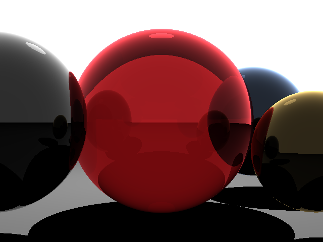

# Ray Tracing in C++ and Metal

This project implements a basic ray tracer in C++ and provides an optimized version using Metal for GPU acceleration on macOS. The ray tracer generates a 3D scene with spheres and light sources, rendering the output as a PPM image.

## Features

- **CPU Implementation**: A basic ray tracer written in C++.
- **GPU Optimization**: A Metal-based implementation for faster rendering on macOS devices with Apple Silicon.
- **Reflections and Transparency**: Supports reflective and transparent surfaces.
- **Lighting**: Includes point light sources with shadow calculations.
- **Scene Customization**: Easily modify the scene by adding or removing spheres and lights.

## File Structure

```
raytracer.cpp          # CPU-based ray tracer implementation
raytracergpu.mm        # GPU-optimized ray tracer using Metal
Raytracer.metal        # Metal shader for GPU ray tracing
compile.sh             # Script to compile the Metal-based implementation
untitled.ppm           # Output image (PPM format)
untitled.png           # High-resolution render with transparency 0.7
untitled comp.png      # First render
untitled comp 2.png    # Render with transparency 0.3
```

## How It Works

### CPU Implementation

The CPU-based ray tracer (`raytracer.cpp`) uses recursive ray tracing to compute:
- **Ray-Sphere Intersections**: Determines if a ray intersects a sphere.
- **Lighting**: Calculates the color of each pixel based on light sources and shadows.
- **Reflections and Refractions**: Handles reflective and transparent surfaces using recursive rays.

### GPU Optimization

The GPU-optimized version (`raytracergpu.mm` and `Raytracer.metal`) leverages Metal's compute shaders to parallelize the rendering process. Each pixel is processed by a separate GPU thread, significantly improving performance.

## How to Run

### CPU Version

1. Compile the CPU version:
   ```bash
   c++ -std=c++14 -O3 -Wall raytracer.cpp -o raytracer
   ```
2. Run the program:
   ```bash
   ./raytracer
   ```
3. The output image will be saved as `untitled.ppm`.

### GPU Version (macOS with Metal)

1. Navigate to the `GPU Optimized` directory:
   ```bash
   cd "GPU Optimized"
   ```
2. Make the compile script executable:
   ```bash
   chmod +x compile.sh
   ```
3. Compile and run the GPU version:
   ```bash
   ./compile.sh && ./raytracergpu
   ```
4. The output image will be saved as `untitled.ppm`.

## Customizing the Scene

### Adding Spheres

To add a sphere, modify the `main` function in `raytracer.cpp` or `raytracergpu.mm`:
```cpp
spheres.push_back(Sphere(Vec3f(x, y, z), radius, surfaceColor, reflection, transparency, emissionColor));
```
- `x, y, z`: Position of the sphere
- `radius`: Radius of the sphere
- `surfaceColor`: RGB color of the sphere
- `reflection`: Reflectivity (0 to 1)
- `transparency`: Transparency (0 to 1)
- `emissionColor`: RGB color of emitted light

### Adding Lights

To add a light source, use the same `Sphere` structure with `emissionColor` set to a non-zero value:
```cpp
spheres.push_back(Sphere(Vec3f(x, y, z), radius, Vec3f(0, 0, 0), 0, 0, emissionColor));
```

## Output

The rendered image is saved in PPM format. You can view it using any image viewer that supports PPM, such as Preview on macOS.

### Example Renders

- **High-resolution render with transparency 0.7**:
  

- **First render**:
  

- **Render with transparency 0.3**:
  

## Performance Comparison

| Version | Resolution | Time |
|---------|------------|------|
| CPU     | 640x480    | ~10s |
| GPU     | 640x480    | ~1s  |

## Requirements

- **CPU Version**: Any platform with a C++14 compiler
- **GPU Version**: macOS with Metal support (Apple Silicon recommended)

## License

See [LICENSE](LICENSE) for license information.
